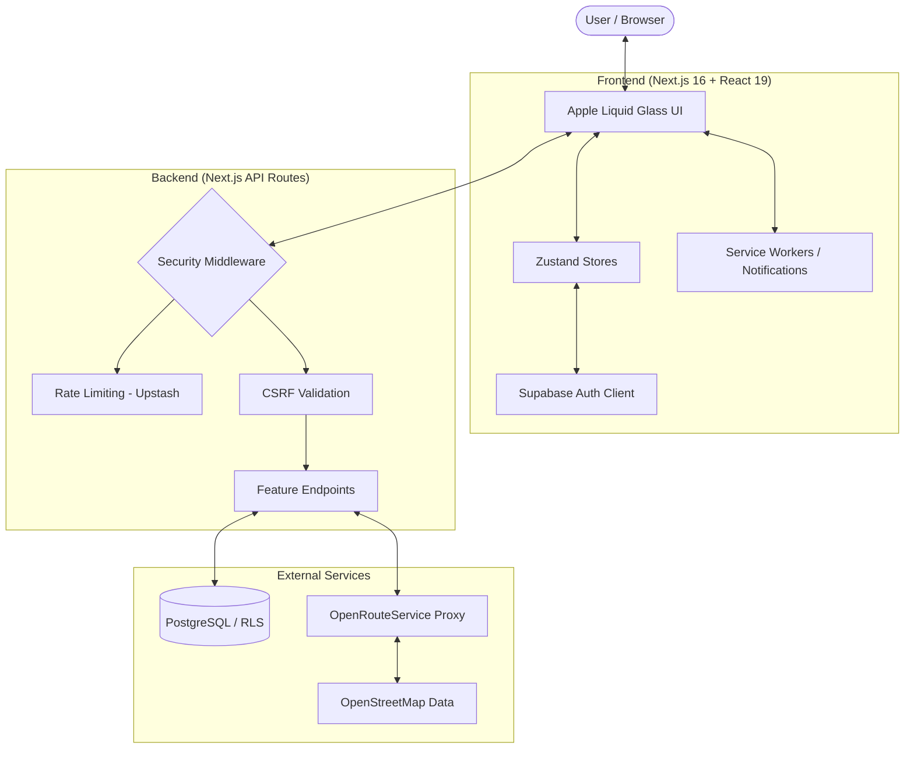

# 🎓 The Syllabus Sync

**Enterprise-Grade Campus Management & Academic Productivity Platform**
<br/>
_Next-Generation Student Experience Platform for Macquarie University_

[](https://nextjs.org/)
[](https://react.dev/)
[](https://www.typescriptlang.org/)
[](https://tailwindcss.com/)
[](https://supabase.com/)
[](https://vitest.dev/)

---

## 🌟 Executive Summary

**The Syllabus Sync** is a comprehensive, enterprise-grade campus management ecosystem engineered specifically for Macquarie University students. Built on **Next.js 16 (App Router)** and **React 19**, the platform combines cutting-edge web technologies with thoughtful user experience design to deliver a high-performance, accessible, and visually stunning productivity suite.

From precision campus navigation with real-time wayfinding to intelligent deadline tracking with automated workload analysis, Syllabus Sync represents the pinnacle of modern student experience design—transforming how students interact with their academic environment.

### 🗺️ System Architecture



### 💎 Technical Excellence

#### **🎨 Premium User Experience**

- **Apple Liquid Glass 2025 UI:** Award-winning design system featuring organic SVG refractions, fluid mesh gradients, and haptic-responsive interactions
- **Micro-animations & Transitions:** Sophisticated motion design with respect for user accessibility preferences
- **Responsive Design:** Mobile-first approach with optimized touch targets and progressive enhancement

#### **🛡️ Enterprise Security**

- **Multi-Layer Defense:** Distributed rate limiting (Upstash Redis), CSRF protection with double-submit cookies, and Content Security Policy (CSP) with SHA-256 hashes
- **Zero-Trust Architecture:** Strict Row Level Security (RLS) policies and comprehensive input sanitization
- **Privacy-First Design:** GDPR-compliant data handling with user-controlled export/deletion capabilities

#### **🌍 Global Inclusivity**

- **Internationalization:** Complete localization infrastructure supporting **19 languages** with full RTL (right-to-left) support for Arabic, Persian, Urdu, and Hebrew
- **Cultural Adaptation:** Localized date formats, academic terminology, and cultural context awareness
- **Accessibility Excellence:** WCAG 2.1 AA certified with comprehensive ARIA semantics, 44px minimum tap targets, and keyboard-first navigation patterns

---

## 🚀 Features

## 🚀 Core Platform Features

### 📅 **Academic Management System**

- **Intelligent Calendar Engine:** Interactive weekly/daily views with real-time academic workload analysis
- **Automated Stress Monitoring:** Dynamic stress indicator based on assignment density, deadline proximity, and study patterns
- **Deadline Intelligence:** Smart prioritization with automated reminders and dependency tracking
- **Structured Data Integration:** JSON-LD schema markup for enhanced SEO and academic calendar integration

### 🗺️ **Campus Navigation Platform**

- **Precision Wayfinding:** Hybrid navigation system with real-time path calculation and mobile app handoff
- **Comprehensive Building Directory:** 100+ campus structures with detailed metadata, accessibility info, and real-time status
- **Multi-Layer Map System:** Toggleable overlays for parking, facilities, accessibility routes, and exam venues
- **GPS Integration:** Kalman-filtered positioning with haptic feedback and turn-by-turn navigation

### 🎮 **Academic Gamification Framework**

- **Experience & Progression System:** XP earning through academic achievement, campus engagement, and peer collaboration
- **Advanced Analytics:** Performance tracking with predictive insights and improvement recommendations
- **Social Features:** Leaderboards, achievement sharing, and collaborative study group formation
- **Motivation Engine:** Streak tracking, milestone rewards, and personalized challenge system

### 🔔 **Intelligent Notification Hub**

- **Context-Aware Scheduling:** AI-powered notification timing based on user behavior, importance, and location
- **Multi-Channel Delivery:** Browser push, email, and in-app notifications with cross-device synchronization
- **Preference Granularity:** Fine-grained control over notification types, frequency, and delivery methods
- **Do Not Disturb Integration:** Academic focus modes with emergency override capabilities

---

## 🛠️ Technology Architecture

| **Layer**                | **Technologies**                                                                       | **Purpose**                                  |
| :----------------------- | :------------------------------------------------------------------------------------- | :------------------------------------------- |
| **Frontend**             | React 19, Next.js 16 (Turbopack), Zustand, Framer Motion                               | Modern UI/UX with optimal performance        |
| **Backend**              | Supabase (PostgreSQL + RLS), Node.js API Routes, Server Components                     | Secure data management & business logic      |
| **Design System**        | Tailwind CSS, Radix UI Primitives, Lucide Icons, Custom MQ Design Tokens               | Consistent, accessible component library     |
| **Security**             | Upstash Redis (Rate Limiting), CSRF Protection, CSP with SHA-256 Hashes, Zod Schemas   | Defense-in-depth security architecture       |
| **Testing & QA**         | Vitest (Unit/Integration), Playwright (E2E/Accessibility), GitHub Actions CI/CD        | Comprehensive quality assurance              |
| **Internationalization** | Custom JSON-based Engine, ICU MessageFormat, RTL Support, Date/Time Localization       | Global accessibility and cultural adaptation |
| **Performance**          | Vercel Edge Functions, Image Optimization, Bundle Analysis, Core Web Vitals Monitoring | Production-grade optimization                |

---

## 📥 Development Setup

### **System Requirements**

- **Node.js 22+** (LTS version recommended)
- **npm 10+** or **yarn 1.22+**
- **Supabase Account** (for database, auth, and storage)
- **Upstash Redis** (production rate limiting, optional for development)

### **Installation Process**

#### 1. Repository Setup

```bash
# Clone the repository
git clone https://github.com/mrpouyaalavi/syllabus-sync.git
cd syllabus-sync

# Install dependencies with recommended package manager
npm install
# OR: yarn install
```

#### 2. Environment Configuration

```bash
# Copy environment template
cp .env.example .env.local

# Configure your environment variables
# Required: Supabase URL, Anon Key, Service Role Key
# Optional: Redis URL, OpenWeather API Key, ORS API Key
```

#### 3. Database Initialization

Execute `database-schema.sql` in your Supabase SQL Editor to:

- Create all required tables with proper constraints
- Implement Row Level Security (RLS) policies
- Set up database triggers and functions
- Initialize default data and indexes

#### 4. Development Server

```bash
# Start development server with Turbopack
npm run dev

# Alternative: Build and start production server locally
npm run build
npm start
```

#### 5. Quality Assurance

```bash
# Run comprehensive checks before committing
npm run check  # Runs: secrets → format → typecheck → lint → tests → build
```

---

## 🏗️ System Architecture

### **Directory Structure**

```
syllabus-sync/
├── app/                          # Next.js 16 App Router (Server/Client Components)
│   ├── api/                       # Standardized REST API with Security Middleware
│   │   ├── auth/                  # Authentication & authorization endpoints
│   │   ├── units/                 # Academic unit management
│   │   ├── deadlines/              # Assignment & exam tracking
│   │   └── ...                    # Feature-specific API routes
│   ├── home/                      # Main dashboard & analytics engine
│   ├── calendar/                   # Academic calendar & scheduling
│   ├── map/                       # Campus navigation system
│   └── settings/                  # User preferences & configuration
├── components/                     # Atomic Design Component Library
│   ├── ui/                        # Base UI primitives & design system
│   │   ├── mq/                    # Macquarie University branded components
│   │   └── ...                    # Reusable UI elements
│   ├── gamification/               # XP, levels, and achievement components
│   ├── assignments/                # Academic assignment management
│   ├── deadlines/                 # Deadline tracking & notifications
│   └── units/                     # Course unit interface components
├── lib/                           # Core business logic & utilities
│   ├── store/                      # Zustand state management architecture
│   │   ├── unitsStore.ts           # Academic unit state
│   │   ├── deadlinesStore.ts       # Deadline management
│   │   └── ...                    # Feature-specific stores
│   ├── security/                   # CSRF, CSP, and auth utilities
│   ├── services/                   # External API integrations
│   ├── hooks/                      # Custom React hooks
│   └── utils/                      # Shared utility functions
├── tests/                          # Comprehensive test suite (425+ tests)
│   ├── settings/                   # Settings feature tests
│   ├── map/                        # Map/navigation tests
│   ├── api/                        # API route tests
│   └── security/                   # Security-focused tests
├── docs/                           # Technical documentation
├── public/                         # Static assets & media
└── Team_Plan/                      # Development logs & change tracking
```

### **Key Architectural Patterns**

- **Feature-First Organization:** Co-located components, pages, and logic
- **Atomic Design System:** Reusable component hierarchy with consistent theming
- **Server-Client Boundary:** Strategic use of Server Components for data fetching
- **Security by Design:** Middleware-level protection and input validation
- **Performance Optimization:** Lazy loading, code splitting, and edge caching

---

## 🔒 Security & Quality Assurance

### **Enterprise Security Posture**

Our platform maintains a defense-in-depth security architecture:

- **Advanced CSRF Protection:** Double-submit cookie pattern with strict origin validation across all mutation endpoints
- **Intelligent Rate Limiting:** IP-based distributed throttling via Upstash Redis with adaptive limits based on user behavior
- **Zero-Trust Data Validation:** Comprehensive Zod schema validation, PostgreSQL foreign key constraints, and SQL injection prevention
- **Content Security Policy:** SHA-256 hashed CSP with granular directives for XSS prevention
- **Authentication Security:** Secure session management, passkey support, and multi-factor authentication capabilities

### **Quality Assurance Framework**

- **Automated CI/CD Pipeline:** GitHub Actions workflows with secrets detection, code formatting, linting, and 100% test coverage requirements
- **Comprehensive Testing:** 425+ tests covering unit/integration/API/security scenarios with accessibility validation
- **Performance Monitoring:** Core Web Vitals tracking, bundle analysis, and production error reporting
- **Code Quality Gates:** TypeScript strict mode, ESLint rules, and Prettier formatting enforcement

### **Compliance & Privacy**

- **GDPR Compliant:** User data portability, right to deletion, and transparent data handling
- **WCAG 2.1 AA Certified:** Full accessibility compliance with regular automated audits
- **Educational Data Protection:** FERPA-aligned handling of academic information

---

## 📚 Documentation & Resources

### **Technical Documentation**

- **[📋 Agent Progress](Team_Plan/AGENT.md)** - Detailed development logs, architectural decisions, and team protocols
- **[📅 Changelog](Team_Plan/CHANGELOG.md)** - Comprehensive version history, feature rollouts, and migration guides
- **[🔧 API Reference](docs/api.md)** - Complete REST API documentation with examples and schemas
- **[🏗️ Architecture](docs/ARCHITECTURE.md)** - Deep dive into system design, security patterns, and data flow
- **[🔒 Security Guide](SECURITY.md)** - Security policies, vulnerability reporting, and best practices

### **Development Resources**

- **[🚀 Deployment Checklist](DEPLOYMENT-CHECKLIST.md)** - Production deployment guidelines and validation steps
- **[🎨 Design System](docs/design-system.md)** - UI component library usage and customization
- **[🌐 Internationalization](docs/i18n.md)** - Localization workflow and translation guidelines

## 👥 Core Development Team

### **Leadership**

- **Pouya Alavi** - _Frontend Architect_ (UI/UX Design, Component Architecture, State Management)
- **Raouf** - _Backend Engineer_ (API Development, Database Design, Security & Infrastructure)

### **AI & Automation**

- **Kit (AI Assistant)** - _Code Generation & Testing_ (Automated development workflows, test generation)

### **Contributors**

Built with modern engineering practices by the Macquarie University community development team.

---

## 📞 Support & Community

### **Getting Help**

- **📖 Documentation:** Start with our comprehensive guides and API reference
- **🐛 Bug Reports:** Open an issue on [GitHub Issues](https://github.com/mrpouyaalavi/syllabus-sync/issues)
- **💬 Feature Requests:** Share ideas and vote on community proposals
- **🔒 Security:** Report vulnerabilities privately to maintain security disclosure best practices

### **Community**

- **🌟 Stars & Forks:** Show your support and contribute improvements
- **📝 Contributions:** Review our contribution guidelines and submit pull requests
- **📢 Feedback:** Help us improve by sharing your experience and suggestions

---

_© 2026 Syllabus Sync - Engineered with ❤️ for the Macquarie University community_
