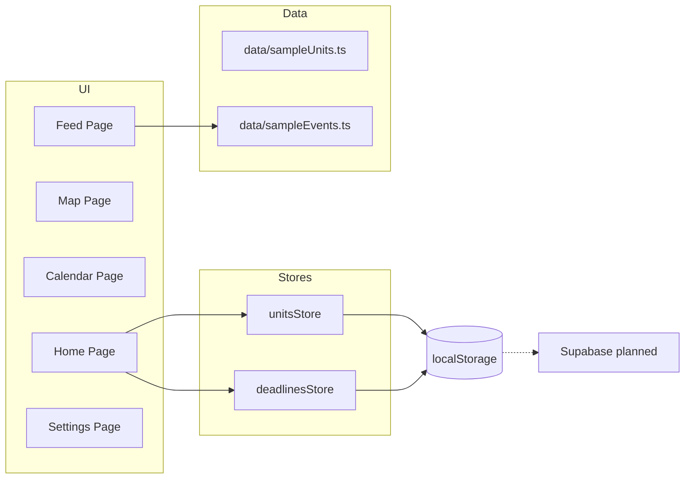

# 🎓 The Syllabus Sync

**Campus Navigation and Schedule Management for Macquarie University**

[](https://nextjs.org/)
[](https://www.typescriptlang.org/)
[](https://tailwindcss.com/)

---

## 📋 Overview

**The Syllabus Sync** is a modern web application designed to help Macquarie University students seamlessly manage their campus life. This demo showcases smart schedule management, deadline tracking, event discovery, and campus navigation - all in one unified platform.

**Demo Purpose:** Presentation to Macquarie University administration as a proposed official campus tool.

---

## 🧭 Architecture Diagram



---

---

## ✨ Demo Features

### 🏠 **Home Dashboard** (Available Now)
- **Today's Schedule:** View your classes for the day with room locations
- **Next Deadline:** Track upcoming assignments with priority levels
- **Events Feed:** Discover campus events across categories (Career, Social, Academic, Free Food)
- **Quick Actions:** Fast navigation to Map and Calendar views

### 📅 **Calendar View** (Coming Soon)
- Visual calendar with integrated class schedules
- Deadline tracking with color-coded priorities
- Multiple view modes (month/week/day)

### 🗺️ **Campus Map** (Coming Soon)
- Interactive campus navigation
- Building locations with room numbers
- Walking directions between locations

### 📱 **Additional Features** (Roadmap)
- Event discovery and filtering
- Smart notifications for classes and deadlines
- Unit management with custom schedules
- Settings and preferences

---

## 🚀 Quick Start

### Prerequisites
- Node.js 18+ and npm

### Installation

1. **Install dependencies**
   ```bash
   npm install
   ```

2. **Run development server**
   ```bash
   npm run dev
   ```

3. **Open in browser**
   ```
   http://localhost:3000
   ```

### Available Scripts
```bash
npm run dev          # Start development server
npm run build        # Build for production
npm run start        # Start production server
npm run lint         # Run ESLint
npm test             # Run tests
```

---

## 📁 Project Structure

```
syllabus-sync/
├── app/                      # Next.js pages
│   ├── home/                # Home dashboard
│   ├── calendar/            # Calendar view
│   ├── map/                 # Campus map
│   ├── feed/                # Events feed
│   └── settings/            # Settings page
├── components/
│   ├── home/                # Dashboard components
│   ├── layout/              # Sidebar & Header
│   ├── ui/                  # Reusable UI components
│   └── units/               # Unit management
├── lib/
│   ├── store/               # State management (Zustand)
│   ├── types/               # TypeScript definitions
│   └── hooks/               # Custom React hooks
└── data/                     # Sample data for demo
```

---

## 👥 Team

- **Pouya** - Frontend Lead, UI/UX, State Management, Home Dashboard
- **Raouf** - Backend Lead, Database Integration, API Development, Map & Settings

---

## 📝 Documentation

- **[AGENT.md](Team_Plan/AGENT.md)** - Complete project documentation
- **[CHANGELOG.md](Team_Plan/CHANGELOG.md)** - Version history
- **[TEAM_ROADMAP.md](Team_Plan/TEAM_ROADMAP.md)** - Team tasks and timeline
- **[ARCHITECTURE.md](docs/ARCHITECTURE.md)** - Architecture overview
- **[API_REFERENCE.md](docs/API_REFERENCE.md)** - Type and store reference
- **[CONTRIBUTING.md](CONTRIBUTING.md)** - Contribution guidelines
- **[CODE_OF_CONDUCT.md](CODE_OF_CONDUCT.md)** - Community standards
- **[SECURITY.md](SECURITY.md)** - Security reporting

---

## 🎯 Roadmap

### ✅ Phase 1 (Weeks 1-2) - COMPLETE

- [x] Project setup (Next.js 16 + TypeScript)
- [x] Layout components (Sidebar + Header)
- [x] Home page with Today's Schedule
- [x] Next Deadline widget
- [x] Events Feed preview
- [x] State management (Zustand)

### 🚧 Phase 2 (Weeks 3-4) - IN PROGRESS

- [ ] Unit Form (Add/Edit/Delete)
- [ ] Deadline management
- [ ] Stress Forecast algorithm
- [ ] Database setup (Supabase)

### ⏳ Phase 3 (Week 5) - Calendar

- [ ] FullCalendar integration
- [ ] Class schedule visualization
- [ ] Deadline integration
- [ ] Event management

### ⏳ Phase 4 (Week 6) - Map

- [ ] Leaflet map setup
- [ ] Building markers
- [ ] Navigation routing
- [ ] Current location tracking

### ⏳ Phase 5 (Week 7) - Events & Polish

- [ ] Live events feed
- [ ] Event interactivity (RSVP, reminders)
- [ ] UI refinements
- [ ] Mobile optimization

### ⏳ Phase 6 (Week 8) - Demo Preparation

- [ ] Demo script
- [ ] Pitch deck (9 slides)
- [ ] Demo video
---

## 🛠 Tech Stack

- **Framework:** Next.js 16 (React 19)
- **Language:** TypeScript
- **Styling:** Tailwind CSS + Shadcn UI
- **State:** Zustand (localStorage)
- **Icons:** Lucide React
- **Date Handling:** date-fns

---

## 🎨 Design System

### Macquarie University Branding
- **Primary Red:** `#A6192E`
- **Primary Blue:** `#002A45`  
- **Accent Gold:** `#FFB81C`

### UI Components
- Built with Shadcn UI
- Responsive design (mobile-first)
- Consistent spacing and typography

---

## 📄 License

MIT License - see [LICENSE](LICENSE) file for details.

---

## 📞 Contact

**Project Team:** Macquarie University Demo Project  
**Demo Target:** University Administration  
**Timeline:** February 2025

---

Built with ❤️ for Macquarie University students

---

## 📊 Project Status

**Current Version:** 0.1.0 (Phase 1 Complete)  
**Last Updated:** December 30, 2025  
**Status:** 🚧 Active Development - Phase 2 In Progress

---

**Made with ❤️ for Macquarie University students**
