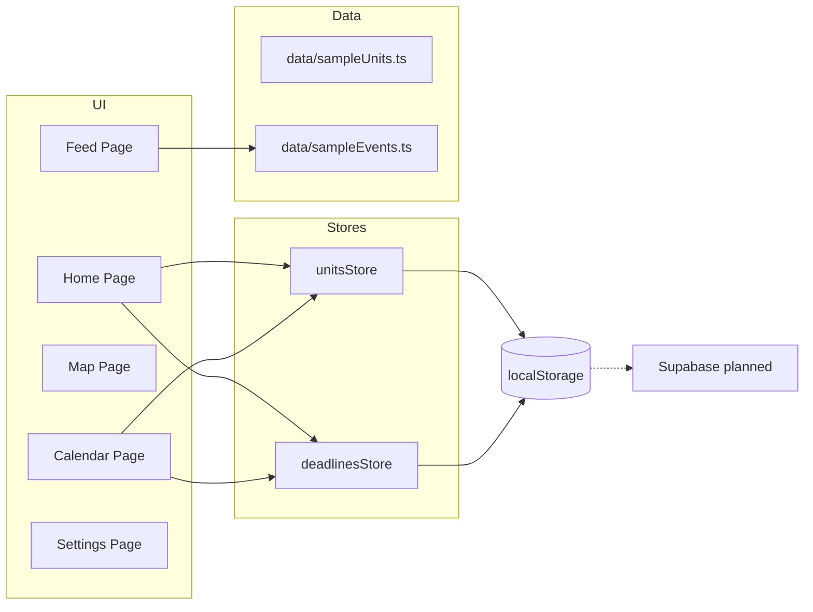

# 🎓 The Syllabus Sync

**Campus Navigation and Schedule Management for Macquarie University**

[](https://nextjs.org/)
[](https://www.typescriptlang.org/)
[](https://tailwindcss.com/)

---

## 📋 Overview

**The Syllabus Sync** is a modern web application designed to help Macquarie University students seamlessly manage their campus life. This demo showcases smart schedule management, deadline tracking, event discovery, and campus navigation - all in one unified platform.

**Demo Purpose:** Presentation to Macquarie University administration as a proposed official campus tool.

---

## 🧭 Architecture Diagram



---

## ✨ Demo Features

### 🏠 **Home Dashboard** (Available Now)
- **Today's Schedule:** View your classes for the day with room locations
- **Next Deadline:** Track upcoming assignments with priority levels
- **My Units:** Full unit management with add/edit/delete functionality
- **Unit Stats:** Total units, classes per week, and study hours
- **Events Feed:** Discover campus events across categories
- **Stress Indicator:** Visual workload indicator based on deadlines

### 📅 **Calendar & Deadlines** (Available Now)
- **Full Deadline Management:** Add, edit, complete, delete deadlines
- **Stats Overview:** Upcoming, completed, overdue counts
- **Completion Toggle:** Mark deadlines as complete/incomplete
- **Stress Level Indicator:** Visual indicator based on workload
- **Priority & Type Badges:** Color-coded priority and deadline types
- **Overdue Detection:** Highlights overdue deadlines
- **Calendar Preview:** Coming soon - interactive calendar view

### 🗺️ **Campus Map** (Preview Available)
- Google Maps embed with Macquarie University location
- Campus buildings quick reference
- Interactive features coming soon

### 📱 **Feed & Events** (Available Now)
- Event discovery and filtering by category
- Career, Social, Academic, and Free Food events
- Time and location details for each event

### ⚙️ **Settings** (Partially Available)
- Clear all data functionality
- Data storage status
- App version and information

---

## 🚀 Quick Start

### Prerequisites
- Node.js 18+ and npm

### Installation

1. **Install dependencies**
   ```bash
   npm install
   ```

2. **Run development server**
   ```bash
   npm run dev
   ```

3. **Open in browser**
   ```
   http://localhost:3000
   ```

### Available Scripts
```bash
npm run dev          # Start development server
npm run build        # Build for production
npm run start        # Start production server
npm run lint         # Run ESLint
npm test             # Run tests
```

---

## 📁 Project Structure

```
syllabus-sync/
├── app/                      # Next.js pages
│   ├── home/                # Home dashboard (Units + Schedule)
│   ├── calendar/            # Calendar view (Deadlines)
│   ├── map/                 # Campus map
│   ├── feed/                # Events feed
│   └── settings/            # Settings page
├── components/
│   ├── home/                # Dashboard components
│   ├── layout/              # Sidebar & Header
│   ├── ui/                  # Reusable UI components
│   ├── units/               # Unit management
│   └── deadlines/           # Deadline management
├── lib/
│   ├── store/               # State management (Zustand)
│   ├── types/               # TypeScript definitions
│   └── hooks/               # Custom React hooks
├── data/                    # Sample data for demo
└── tests/                   # Unit tests
```

---

## 👥 Team

| Role | Member | Responsibilities |
|------|--------|------------------|
| **Frontend Lead** | Pouya | UI/UX, Components, State Management |
| **Backend Lead** | Raouf | Database, API, Configuration |

See [TEAM_ROLES.md](Team_Plan/TEAM_ROLES.md) for detailed responsibilities.

---

## 📝 Documentation

- **[AGENT.md](Team_Plan/AGENT.md)** - Complete project documentation
- **[CHANGELOG.md](Team_Plan/CHANGELOG.md)** - Version history
- **[TEAM_ROLES.md](Team_Plan/TEAM_ROLES.md)** - Team responsibilities
- **[CONTRIBUTING.md](CONTRIBUTING.md)** - Contributing guidelines
- **[CODE_OF_CONDUCT.md](CODE_OF_CONDUCT.md)** - Community guidelines
- **[SECURITY.md](SECURITY.md)** - Security policy

---

## 🎯 Roadmap

### ✅ Phase 1 (Weeks 1-2) - COMPLETE

- [x] Project setup (Next.js 16 + TypeScript)
- [x] Layout components (Sidebar + Header)
- [x] Home page with Today's Schedule
- [x] Next Deadline widget
- [x] Events Feed preview
- [x] State management (Zustand)
- [x] Unit management (add/edit/delete)
- [x] Deadline management
- [x] Mobile responsive sidebar
- [x] Stress level indicator

### 🚧 Phase 2 (Weeks 3-4) - IN PROGRESS

- [ ] Database setup (Supabase)
- [ ] User authentication
- [ ] Cloud sync for data
- [ ] Push notifications

### ⏳ Phase 3 (Week 5) - Calendar

- [ ] FullCalendar integration
- [ ] Class schedule visualization
- [ ] Deadline integration on calendar

### ⏳ Phase 4 (Week 6) - Map

- [ ] Interactive campus map
- [ ] Building markers
- [ ] Navigation routing

### ⏳ Phase 5-6 (Weeks 7-8) - Polish & Demo

- [ ] UI refinements
- [ ] Performance optimization
- [ ] Demo preparation

---

## 🛠 Tech Stack

| Category | Technology |
|----------|------------|
| Framework | Next.js 16 (React 19) |
| Language | TypeScript 5.x |
| Styling | Tailwind CSS + Shadcn UI |
| State | Zustand (localStorage) |
| Icons | Lucide React |
| Date Handling | date-fns |
| Testing | Vitest + Testing Library |

---

## 🎨 Design System

### Macquarie University Branding
- **Primary Red:** `#A6192E`
- **Primary Blue:** `#002A45`  
- **Accent Gold:** `#FFB81C`

---

## 📄 License

MIT License - see [LICENSE](LICENSE) file for details.

---

## 📊 Project Status

**Current Version:** 0.4.0  
**Last Updated:** December 31, 2025  
**Status:** 🚧 Active Development

---

**Made with ❤️ for Macquarie University students**
