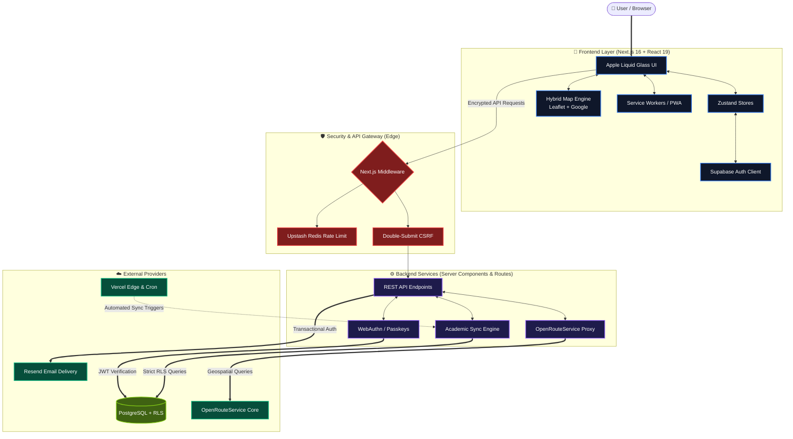

# 🎓 The Syllabus Sync

**Enterprise-Grade Campus Management & Academic Productivity Platform**
<br/>
_Next-Generation Student Experience Platform for Macquarie University_

[](https://nextjs.org/)
[](https://react.dev/)
[](https://www.typescriptlang.org/)
[](https://tailwindcss.com/)
[](https://supabase.com/)
[](https://vitest.dev/)

---

## 🌟 Executive Summary

**The Syllabus Sync** is a comprehensive, enterprise-grade campus management ecosystem engineered specifically for Macquarie University students. Built on **Next.js 16 (App Router)** and **React 19**, the platform combines cutting-edge web technologies with thoughtful user experience design to deliver a high-performance, accessible, and visually stunning productivity suite.

From precision campus navigation with real-time wayfinding to intelligent deadline tracking with automated workload analysis, Syllabus Sync represents the pinnacle of modern student experience design—transforming how students interact with their academic environment.

### 🗺️ System Architecture



### 💎 Technical Excellence

#### **🎨 Premium User Experience**

- **Apple Liquid Glass 2025 UI:** Award-winning design system featuring organic SVG refractions, fluid mesh gradients, and haptic-responsive interactions
- **Micro-animations & Transitions:** Sophisticated motion design with respect for user accessibility preferences
- **Responsive Design:** Mobile-first approach with full breakpoint passes (360px-2560px) across all pages — login, calendar, map, settings, manage-profiles — with optimized touch targets and progressive enhancement

#### **🛡️ Enterprise Security**

- **Multi-Layer Defense:** Distributed rate limiting (Vercel KV / Upstash Redis in production, Supabase Postgres fallback), CSRF protection with double-submit cookies, and Content Security Policy (CSP) with SHA-256 hashes
- **Zero-Trust Architecture:** Strict Row Level Security (RLS) policies and comprehensive input sanitization
- **Privacy-First Design:** GDPR-compliant data handling with user-controlled export/deletion capabilities

#### **🌍 Global Inclusivity**

- **Internationalization:** Complete localization infrastructure supporting **19 languages** with full RTL (right-to-left) support for Arabic, Persian, Urdu, and Hebrew
- **Cultural Adaptation:** Localized date formats, academic terminology, and cultural context awareness
- **Accessibility Excellence:** WCAG 2.1 AA certified with comprehensive ARIA semantics, 44px minimum tap targets, and keyboard-first navigation patterns

---

## 🚀 Core Platform Features

### 📅 **Academic Management System**

- **Intelligent Calendar Engine:** Interactive weekly/daily views with real-time academic workload analysis
- **Automated Stress Monitoring:** Dynamic stress indicator based on assignment density, deadline proximity, and study patterns
- **Deadline Intelligence:** Smart prioritization with automated reminders and dependency tracking
- **Structured Data Integration:** JSON-LD schema markup for enhanced SEO and academic calendar integration

### 🗺️ **Campus Navigation Platform**

- **Precision Wayfinding System:** Dual-engine architecture featuring an advanced in-house Leaflet-based renderer alongside dynamic Google Maps integration with precise coordinate tracking.
- **Real-Time GPS Engine:** High-frequency tracker utilizing `navigator.geolocation.watchPosition` enriched by sensor-fusion, Kalman filtering, and spatial threshold debouncing (~20m bounds) to completely eliminate map-flashing and UI jitter during active roaming.
- **Turn-by-Turn Telemetry:** Resilient routing subsystem powered by OpenRouteService with built-in crash-hardening, graceful missing-instruction handlers, and dynamic off-route recalibration capabilities.
- **Comprehensive Building Directory:** Highly curated geospatial layer containing 100+ campus structures, dynamic visual overlays (parking, events), and accessibility status vectors.

### 🎮 **Academic Gamification Framework**

- **Experience & Progression System:** XP earning through academic achievement, campus engagement, and peer collaboration
- **Advanced Analytics:** Performance tracking with predictive insights and improvement recommendations
- **Social Features:** Leaderboards, achievement sharing, and collaborative study group formation
- **Motivation Engine:** Streak tracking, milestone rewards, and personalized challenge system

### 🔐 **Security & Authentication**

- **Custom Email Verification:** Production-ready email verification via Resend with SHA-256 token hashing, 20-minute expiry, and rate limiting (3 sends/hour)
- **Multi-Factor Authentication:** TOTP authenticator app support (Google Authenticator, Authy) with fail-closed login enforcement
- **WebAuthn/Passkey Support:** FIDO2 passkey registration and login with biometric indicators on the login page
- **Gamification Security Hardening:** Cross-user mutation guards, SECURITY DEFINER lockdown, and search_path hardening on database RPCs
- **Database Alignment:** Full code-to-migration audit ensuring all referenced tables and RPCs exist in canonical Supabase migrations

### 🔔 **Intelligent Notification Hub**

- **Context-Aware Scheduling:** AI-powered notification timing based on user behavior, importance, and location
- **Multi-Channel Delivery:** Browser push, email, and in-app notifications with cross-device synchronization
- **Preference Granularity:** Fine-grained control over notification types, frequency, and delivery methods
- **Do Not Disturb Integration:** Academic focus modes with emergency override capabilities

---

## 🛠️ Technology Architecture

| **Layer**                | **Technologies**                                                                       | **Purpose**                                  |
| :----------------------- | :------------------------------------------------------------------------------------- | :------------------------------------------- |
| **Frontend**             | React 19, Next.js 16 (Turbopack), Zustand, Framer Motion                               | Modern UI/UX with optimal performance        |
| **Backend**              | Supabase (PostgreSQL + RLS), Node.js API Routes, Server Components                     | Secure data management & business logic      |
| **Design System**        | Tailwind CSS, Radix UI Primitives, Lucide Icons, Custom MQ Design Tokens               | Consistent, accessible component library     |
| **Security**             | Upstash Redis (Rate Limiting), CSRF Protection, CSP with SHA-256 Hashes, Zod Schemas   | Defense-in-depth security architecture       |
| **Testing & QA**         | Vitest (Unit/Integration), Playwright (E2E/Accessibility), GitHub Actions CI/CD        | Comprehensive quality assurance              |
| **Internationalization** | Custom JSON-based Engine, ICU MessageFormat, RTL Support, Date/Time Localization       | Global accessibility and cultural adaptation |
| **Performance**          | Vercel Edge Functions, Image Optimization, Bundle Analysis, Core Web Vitals Monitoring | Production-grade optimization                |

---

## 📥 Development Setup

### **System Requirements**

- **Node.js 22+** (LTS version recommended)
- **npm 10+** or **yarn 1.22+**
- **Supabase Account** (for database, auth, and storage)
- **Upstash Redis** (recommended for high-traffic production rate limiting; optional)

### **Installation Process**

#### 1. Repository Setup

```bash
# Clone the repository
git clone https://github.com/mrpouyaalavi/syllabus-sync.git
cd syllabus-sync

# Install dependencies with recommended package manager
npm install
# OR: yarn install
```

#### 2. Environment Configuration

```bash
# Copy environment template
cp .env.example .env.local

# Configure your environment variables
# Required: Supabase URL, Anon Key, Service Role Key
# Optional: Redis URL, OpenWeather API Key, ORS API Key
```

Email (Resend) + Vercel notes:

- Transactional email (verification) is sent via **Resend** using `RESEND_API_KEY` and `VERIFICATION_EMAIL_FROM`.
- Vercel Cron endpoints are protected by `CRON_SECRET`.
- Setup guide: `docs/operations/resend-vercel-setup.md`
- OAuth setup: `docs/operations/supabase-oauth-setup.md`

If you deploy to Vercel using the CLI, the repo includes pinned scripts:

```bash
npm run vercel:link
VERCEL_ENVIRONMENT=production npm run vercel:env:check
npm run vercel:deploy:prod
```

#### 3. Database Initialization

Execute `docs/database/database-schema.sql` in your Supabase SQL Editor to:

- Create all required tables with proper constraints
- Implement Row Level Security (RLS) policies
- Set up database triggers and functions
- Initialize default data and indexes

#### 4. Development Server

```bash
# Start development server with Turbopack
npm run dev

# Alternative: Build and start production server locally
npm run build
npm start
```

#### 5. Quality Assurance

```bash
# Run comprehensive checks before committing
npm run check  # Runs: secrets → format → typecheck → lint → tests → build

# Run lint only (fast local feedback during development)
npm run lint
```

### **Common Development Commands**

```bash
npm run dev           # Start local development server
npm run lint          # ESLint checks
npm run typecheck     # TypeScript type checks (no emit)
npm run test          # Run test suite
npm run build         # Production build validation
```

---

## 🏗️ System Architecture

### **Directory Structure**

```
syllabus-sync/
├── app/                          # Next.js 16 App Router (Server/Client Components)
│   ├── api/                       # Standardized REST API with Security Middleware
│   │   ├── auth/                  # Authentication & authorization endpoints
│   │   ├── units/                 # Academic unit management
│   │   ├── deadlines/              # Assignment & exam tracking
│   │   └── ...                    # Feature-specific API routes
│   ├── home/                      # Main dashboard & analytics engine
│   ├── calendar/                   # Academic calendar & scheduling
│   ├── map/                       # Campus navigation system
│   ├── feed/                      # Public event feed
│   ├── login/                     # Authentication login page
│   ├── signup/                    # User registration flow
│   ├── verify/                    # Email verification landing page
│   ├── manage-profiles/           # Multi-profile management
│   └── settings/                  # User preferences & configuration
├── features/                       # Feature-first modules
│   ├── map/                       # Campus map feature module
│   ├── calendar/                  # Calendar feature module
│   ├── settings/                  # Settings feature module
│   ├── feed/                      # Feed feature module
│   ├── home/                      # Home dashboard feature module
│   ├── auth/                      # Auth feature module
│   └── gamification/              # XP and progression feature module
├── components/                     # Shared component layers
│   ├── ui/                        # Shared UI primitives
│   └── layout/                    # Shared layout components
├── lib/                           # Core business logic & utilities
│   ├── store/                      # Zustand state management architecture
│   │   ├── unitsStore.ts           # Academic unit state
│   │   ├── deadlinesStore.ts       # Deadline management
│   │   └── ...                    # Feature-specific stores
│   ├── security/                   # CSRF, CSP, and auth utilities
│   ├── services/                   # External API integrations
│   ├── hooks/                      # Custom React hooks
│   └── utils/                      # Shared utility functions
├── tests/                          # Comprehensive test suite (482+ tests)
│   ├── settings/                   # Settings feature tests
│   ├── map/                        # Real-time navigation tests (68 tests)
│   ├── gamification/               # Gamification logic tests
│   ├── api/                        # API route and authentication tests
│   ├── security/                   # Security boundary tests
│   └── unit/                       # Unit tests for core primitives
├── docs/                           # Documentation and project artifacts
│   ├── README.md                  # Docs index
│   └── project/                   # Team plans, sketches, restructure notes
├── config/                         # Tooling configuration (next/ts/eslint/vitest/etc.)
├── infra/                          # Infrastructure assets (Docker, deployment helpers)
├── tools/                          # Operational tooling (proxy/loadtest utilities)
├── supabase/                       # Database migrations & configuration
│   └── migrations/                # Ordered SQL migration files
├── public/                         # Static assets & media (includes sw.js)
└── assets/                         # Non-public source assets
```

### **Key Architectural Patterns**

- **Feature-First Organization:** Co-located components, pages, and logic
- **Atomic Design System:** Reusable component hierarchy with consistent theming
- **Server-Client Boundary:** Strategic use of Server Components for data fetching
- **Security by Design:** Middleware-level protection and input validation
- **Performance Optimization:** Lazy loading, code splitting, and edge caching

---

## 🔒 Security & Quality Assurance

### **Enterprise Security Posture**

Our platform maintains a defense-in-depth security architecture:

- **Advanced CSRF Protection:** Double-submit cookie pattern with strict origin validation across all mutation endpoints
- **Intelligent Rate Limiting:** IP-based distributed throttling via Upstash Redis with adaptive limits based on user behavior
- **Zero-Trust Data Validation:** Comprehensive Zod schema validation, PostgreSQL foreign key constraints, and SQL injection prevention
- **Content Security Policy:** SHA-256 hashed CSP with granular directives for XSS prevention
- **Authentication Security:** Secure session management, passkey/WebAuthn support, TOTP authenticator app 2FA, and custom email verification via Resend (SHA-256 hashed tokens, 20-min expiry, rate-limited)

### **Quality Assurance Framework**

- **Automated CI/CD Pipeline:** GitHub Actions workflows with secrets detection, code formatting, linting, Vercel deployments, and mandatory test coverage requirements.
- **Comprehensive Testing:** Over 480 verified tests across unit, integration, and security layers. Fully mocked map components test GPS drift without real-world latency.
- **Performance Monitoring:** Core Web Vitals tracking, bundle analysis, and 60fps framerate locking on critical UI animations.
- **Code Quality Gates:** Edge-native TypeScript strictness, automated ESLint formatting, and Prettier CI checks.

### **Compliance & Privacy**

- **GDPR Compliant:** User data portability, right to deletion, and transparent data handling
- **WCAG 2.1 AA Certified:** Full accessibility compliance with regular automated audits
- **Educational Data Protection:** FERPA-aligned handling of academic information

---

## 📚 Documentation & Resources

### **Technical Documentation**

- **[📋 Agent Progress](docs/project/team_plan/AGENT.md)** - Detailed development logs, architectural decisions, and team protocols
- **[📅 Changelog](docs/project/team_plan/CHANGELOG.md)** - Comprehensive version history, feature rollouts, and migration guides
- **[🗂️ Restructure Notes](docs/project/restructure-notes.md)** - Before/after tree and migration decisions
- **[📁 Docs Index](docs/README.md)** - Documentation structure and usage
- **[🔒 Security Guide](SECURITY.md)** - Security policies, vulnerability reporting, and best practices
- **[🛡️ Privacy Policy](docs/policies/privacy-policy.md)** - What data this app collects, uses, and shares
- **[🛡️ Security Posture Report](docs/security/SECURITY_POSTURE.md)** - Evidence-backed hardening controls and threat snapshot
- **[🧾 Security Evidence Index](docs/security/SECURITY_EVIDENCE_INDEX.md)** - Reviewer index of security controls by file path

### **Development Resources**

- **[🚀 Deployment Checklist](docs/operations/deployment-checklist.md)** - Production deployment guidelines and validation steps
- **[🔐 Supabase OAuth Setup](docs/operations/supabase-oauth-setup.md)** - Google/Facebook OAuth configuration and redirect URLs
- **[🎨 Design Sketches](docs/project/sketch/)** - Project concept and UI sketches

## 👥 Core Development Team

### **Leadership**

- **Pouya Alavi** - _Frontend Architect_ (UI/UX Design, Component Architecture, State Management)
- **Raouf** - _Backend Engineer_ (API Development, Database Design, Security & Infrastructure)

### **AI & Automation**

- **Kit (AI Assistant)** - _Code Generation & Testing_ (Automated development workflows, test generation)

### **Contributors**

Built with modern engineering practices by the Macquarie University community development team.

---

## 📞 Support & Community

### **Getting Help**

- **📖 Documentation:** Start with our comprehensive guides and API reference
- **🐛 Bug Reports:** Open an issue on [GitHub Issues](https://github.com/mrpouyaalavi/syllabus-sync/issues)
- **💬 Feature Requests:** Share ideas and vote on community proposals
- **🔒 Security:** Report vulnerabilities privately to maintain security disclosure best practices

### **Community**

- **🌟 Stars & Forks:** Show your support and contribute improvements
- **📝 Contributions:** Review our contribution guidelines and submit pull requests
- **📢 Feedback:** Help us improve by sharing your experience and suggestions

---

_© 2026 Syllabus Sync - Engineered with ❤️ for the Macquarie University community_
