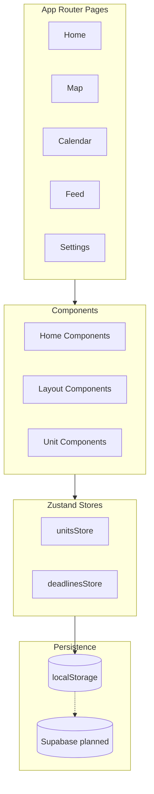

# Architecture Overview

## Summary

The Syllabus Sync is a Next.js (App Router) application using TypeScript, Tailwind CSS, and Zustand for client-side state. Data is currently stored in localStorage for the MVP, with a planned migration to Supabase.

## Architecture Diagram

## Key Modules

- app/: Route entry points and page layouts
- components/: UI and feature components
- lib/store/: Zustand state stores
- lib/types/: Shared TypeScript types
- data/: Sample data for demo

## Data Flow

1. UI components read and write state through Zustand stores.
2. Stores persist data to localStorage using Zustand middleware.
3. Sample data is seeded on first run to support demo flows.

## State Management

Zustand stores handle CRUD operations for units and deadlines. Each store exposes selectors for derived data (e.g., upcoming deadlines).

## Routing

App Router pages are located in app/ with route-specific layouts and components.

## Testing Strategy

- Unit tests are executed using Vitest and Testing Library.
- Tests focus on component rendering and utility logic.

## CI/CD

- Lint workflow runs on push and pull requests.
- Test workflow runs on push and pull requests.

## Formatting

- Prettier is enforced via `npm run format:check`.
- Editor settings follow `.editorconfig`.

## Future Improvements

- Replace localStorage persistence with Supabase-backed APIs.
- Add authenticated flows and server-side data fetching.
- Expand test coverage for stores and components.
