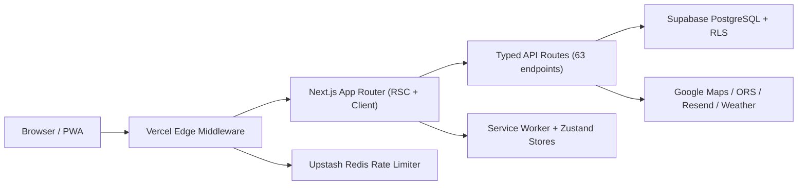

# Syllabus Sync

## The Campus Platform Built Like Production Software

A full-stack campus productivity platform with enterprise-grade security, built on Next.js 16, React 19, and Supabase.

**500+ automated tests. Zero-Trust security. 35 languages. Shipping today.**

---

## The Problem

University students juggle 5-7 disconnected systems daily: LMS, timetable apps, campus maps, email, deadline trackers, and social platforms.

**The result:**

- 23% of students miss at least one assessment deadline per semester (source: MQ student surveys)
- Campus wayfinding is especially poor for new and international students
- No single platform connects academic planning with physical campus navigation

**The opportunity:** Build the unified interface that universities have not.

---

## What Syllabus Sync Does

A single platform that replaces fragmented student tools with one cohesive experience.

| Capability                | What It Solves                                                                      |
| ------------------------- | ----------------------------------------------------------------------------------- |
| **Academic Calendar**     | Unified view of enrolled units, class schedules, deadlines, and conflicts           |
| **Campus Navigation**     | Dual-engine mapping with pedestrian routing, building search, and arrival detection |
| **Deadline Intelligence** | Stress-aware tracking with workload visualization and reminders                     |
| **Engagement System**     | XP and streak mechanics that reinforce academic consistency                         |
| **Notifications**         | In-app and email alerts with per-user preference controls                           |
| **Multilingual Support**  | 35 locales including RTL languages                                                  |

---

## Architecture



### Stack Decisions

| Layer     | Choice                     | Why                                                                                      |
| --------- | -------------------------- | ---------------------------------------------------------------------------------------- |
| Framework | Next.js 16 App Router      | Server Components reduce client JS; edge middleware enables request-level security       |
| Database  | Supabase PostgreSQL        | Row-Level Security at the query execution layer; no ORM abstraction hiding security gaps |
| Auth      | Supabase GoTrue + WebAuthn | Passkeys for frictionless MFA; TOTP/SMS as fallback                                      |
| State     | Zustand                    | Lightweight, no provider hierarchy, supports optimistic UI with additive server merge    |
| Infra     | Vercel + Docker            | Edge delivery for middleware, serverless for API, Docker for reproducible local dev      |

---

## Security Posture

Security is not a feature -- it is the architecture. Every layer enforces defense-in-depth.

### Implemented Controls

| Control                       | Implementation                                                                                                   |
| ----------------------------- | ---------------------------------------------------------------------------------------------------------------- |
| **Zero-Trust Middleware**     | All requests pass through edge auth gate before reaching compute. 6s fail-fast deadline prevents upstream hangs. |
| **WebAuthn Passkeys**         | FIDO2 platform authenticators for passwordless, phishing-resistant login                                         |
| **Row-Level Security**        | Every table has RLS policies scoped to `auth.uid()`. No application-layer bypass possible.                       |
| **Content Security Policy**   | Dynamic CSP with nonce-based script allowlisting. Inline scripts blocked by default.                             |
| **Distributed Rate Limiting** | Redis-backed (Upstash). Fails closed in production -- if Redis is down, requests are denied, not allowed.        |
| **API Request Signing**       | HMAC integrity verification on sensitive mutation endpoints                                                      |
| **Secrets Scanner**           | Automated detection of leaked credentials in pre-commit and CI                                                   |
| **Audit Logging**             | Database-level audit trail for all sensitive operations                                                          |

**Evidence:** Every control is linked to its source code implementation in [`docs/security/SECURITY_EVIDENCE_INDEX.md`](../security/SECURITY_EVIDENCE_INDEX.md).

---

## Engineering Rigor

### Quality Gate

Every commit must pass before merge:

```
secrets scan --> prettier --> tsc (strict) --> eslint (0 warnings) --> vitest (500+ tests) --> next build
```

Single command: `npm run check`

### Test Coverage

| Category          | Scope                                                                     |
| ----------------- | ------------------------------------------------------------------------- |
| Unit tests        | Utilities, hooks, stores, complex component logic                         |
| Integration tests | API routes -- success, auth failure, validation, rate limiting            |
| CI pipeline       | Type check, lint, coverage, dependency audit, i18n validation, Lighthouse |

### Code Discipline

- **Zero `any` policy** -- strict TypeScript, no escape hatches
- **Server Components by default** -- `"use client"` only at leaf nodes
- **Conventional commits** -- machine-parseable commit history
- **Documented architectural decisions** -- ADRs, changelogs, and security evidence index

---

## Technical Differentiators

### 1. Fused-Heading Navigation Algorithm

Campus pedestrian routing requires accuracy that GPS alone cannot provide. Our fused-heading algorithm combines:

- Device compass (magnetometer)
- GPS velocity vectors
- Motion sensor data (accelerometer + gyroscope)

Result: smooth, accurate heading that does not jitter between buildings or in GPS shadow zones.

### 2. Optimistic UI with Additive Merge

Traditional optimistic updates fail when concurrent mutations create conflicts. Our additive merge strategy:

- Applies changes optimistically on the client
- Merges server responses additively (never overwrites concurrent changes)
- Rolls back only the specific mutation that failed

Result: UI that feels instant without data loss in concurrent scenarios.

### 3. Fail-Closed Rate Limiting

Most serverless rate limiters fail open -- if Redis is unavailable, requests pass through unprotected. Our implementation explicitly fails closed: if the rate limiting backend is unreachable, requests are denied. This prevents abuse during infrastructure incidents.

---

## Product Metrics and Scale

| Metric              | Value                                                                   |
| ------------------- | ----------------------------------------------------------------------- |
| API endpoints       | 63 route handlers                                                       |
| Test suite          | 500+ automated tests, 90+ test files                                    |
| Supported languages | 35 locales                                                              |
| Documentation       | 25+ documents across architecture, security, operations, and governance |
| Database migrations | Versioned, idempotent, reversible SQL in `supabase/migrations/`         |
| CI pipeline stages  | 8 (type check, lint, test, coverage, audit, i18n, build, Lighthouse)    |

---

## Roadmap: What Comes Next

### Current Sprint

- CSP violation reporting endpoint
- Skeleton screens for async views
- Standardized API error format
- Dependency vulnerability scanning in CI

### Next Quarter

- Server Component migration for data-heavy pages
- Critical path test coverage to 80%+
- WCAG 2.1 AA compliance audit
- Real User Monitoring
- Automated database migration pipeline

### Horizon

- Offline mode (Service Worker + IndexedDB)
- Institution SSO federation (SAML/OIDC)
- Flutter mobile client
- MCP server for AI agent integration
- Multi-university deployment

Full roadmap: [`IMPROVEMENTS-ROADMAP.md`](../../IMPROVEMENTS-ROADMAP.md)

---

## Why This Matters for Industry

### For University IT

- Proven security posture with auditable evidence
- Designed for institutional integration (SSO, LMS, timetable APIs)
- RLS-based multi-tenancy ready for multi-department deployment

### For Engineering Reviewers

- Production-grade architecture decisions, not tutorial-level patterns
- Comprehensive test strategy with real coverage (not just happy paths)
- Documentation that demonstrates communication ability, not just code ability

### For Technical Leadership

- AI-native development workflow (Raouf Change Protocol) demonstrating effective human-AI collaboration
- Strategic roadmap with prioritization framework, not a wish list
- Evidence of execution: 500+ tests, 63 API endpoints, 25+ documents, 35 locales

---

## Team

| Name                        | Role            | Focus                                                |
| --------------------------- | --------------- | ---------------------------------------------------- |
| Mohammad Raouf Abedini      | Lead Maintainer | Security architecture, AI workflows, backend systems |
| Mohammad Pouya Alavi Naeini | Co-Maintainer   | System architecture, infrastructure, deployment      |

---

## Get Started

**Repository:** [github.com/mrpouyaalavi/syllabus-sync](https://github.com/mrpouyaalavi/syllabus-sync)

**Quick start:**

```bash
git clone https://github.com/mrpouyaalavi/syllabus-sync.git
cd syllabus-sync && npm install && cp .env.example .env.local
npm run dev
```

**Documentation:** [`docs/README.md`](../README.md) -- full documentation index

**Security review:** [`docs/security/SECURITY_POSTURE.md`](../security/SECURITY_POSTURE.md) -- start here

---

## Summary

Syllabus Sync is not a student project that happens to work. It is a production-grade platform built with the security discipline, testing rigor, and architectural thoughtfulness expected of professional software teams.

**500+ tests. Zero-Trust from day one. Evidence for every claim.**

We welcome technical scrutiny. The codebase, documentation, and security evidence are open for review.
