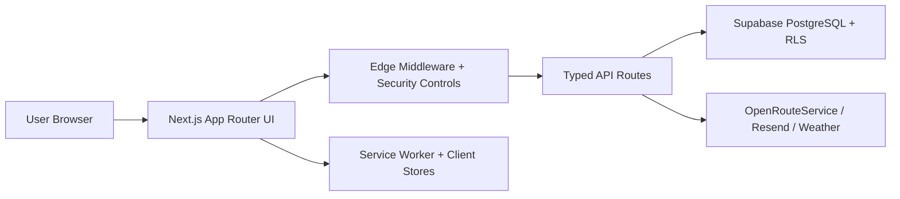

# Syllabus Sync

## Production-Grade Campus Platform

Macquarie University-focused student productivity ecosystem  
Next.js 16 + React 19 + Supabase + Enterprise security controls

---

## 1) Executive Snapshot

- Product: End-to-end campus management and academic productivity platform
- Positioning: Enterprise-ready student experience system
- Scope: calendar, feed, map navigation, profile, security center, notifications
- Audience: students, university stakeholders, technical reviewers
- Status: active production-readiness workflow with documented controls

---

## 2) Business and User Value

- Unifies scheduling, deadlines, events, and wayfinding in one app
- Reduces missed deadlines with reminders and workload visibility
- Improves campus discoverability through route guidance and map tools
- Enables multilingual and accessibility-forward student experience
- Supports continuous delivery with quality and security gates

---

## 3) Platform Capabilities

- Academic management: planning, deadlines, reminders, stress-aware indicators
- Campus navigation: Leaflet + Google integrations, route assist, building lookup
- Gamification: XP/streak mechanics, engagement loops, secure reward flows
- Notifications: in-app and email integrations with preference controls
- Account security: MFA, passkeys, verification, route-level protections

---

## 4) Technical Architecture

- Frontend: React 19, Zustand, Tailwind-based design system
- Backend: API routes + Supabase with RLS and migration discipline
- Infra: Vercel-centric workflows, Docker support, CI quality gates

---

## 5) Security Posture (Evidence-Driven)

- Request hardening: schema validation, size limits, route controls
- Defense-in-depth: CSP, HSTS, rate limiting, origin/CSRF strategies
- Data protection: RLS, service-role isolation, sanitized error handling
- Auth hardening: passkeys/MFA support and verification workflows
- Security documentation: posture report + evidence index maintained in repo

References:

- `docs/security/SECURITY_POSTURE.md`
- `docs/security/SECURITY_EVIDENCE_INDEX.md`
- `SECURITY.md`

---

## 6) Reliability and Quality Engineering

- Unified validation workflow: format, lint, typecheck, tests, build
- Automated secret checks and developer guardrails
- Test strategy: unit/integration (Vitest) + E2E (Playwright)
- Documented ops runbooks for deployment and provider setup
- Ongoing AGENT/CHANGELOG traceability for auditability

---

## 7) Documentation and Governance Strength

- Professional repo standards implemented:
  - `README.md`
  - `CONTRIBUTING.md`
  - `CODE_OF_CONDUCT.md`
  - `LICENSE`
  - `SECURITY.md` + policy docs
- Structured docs index and operations playbooks
- Architecture and security narratives ready for stakeholder review

---

## 8) Team and Delivery Model

- Feature ownership and roadmap defined in `docs/project/team_plan/`
- Structured phased delivery from code quality to production readiness
- Shared accountability model across frontend, backend, and security
- Current roadmap supports post-demo scale and enterprise evolution

---

## 9) Operations and Deployment Readiness

- Deployment checklist includes schema, API, security, and verification steps
- Supabase migration strategy documented and versioned
- Resend + Vercel operational setup documented
- Dockerized local/prod workflows available under `infra/docker/`

---

## 10) Maturity Assessment

### Strengths

- Strong technical stack alignment
- Security-aware architecture and evidence index
- Rich documentation footprint and workflow hygiene

### Current Focus Areas

- Continue roadmap hardening items from `IMPROVEMENTS-ROADMAP.md`
- Keep test and quality metrics current with feature growth
- Maintain strict docs-code parity as architecture evolves

---

## 11) 30-60-90 Day Execution Plan

- 30 days: close high-priority roadmap and security evidence gaps
- 60 days: deepen observability, reliability baselines, and test depth
- 90 days: finalize enterprise packaging for stakeholder and hiring review

Success metrics:

- Stable check pipeline (`npm run check`)
- Security controls evidenced and reviewable
- Demonstrable user impact in academic and navigation flows

---

## 12) Closing

Syllabus Sync is positioned as a production-grade, security-conscious, documentation-rich platform suitable for:

- University demo environments
- Industry-facing technical review
- Portfolio and hiring-panel evaluation

Next artifact options: exported PDF deck, visual theme variant, investor/technical split decks.
